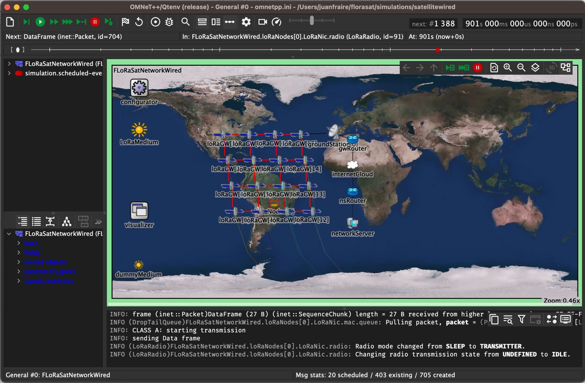

# FLoRaSat

FLoRaSat (Framework for LoRa-based Satellite networks) is an Omnet++ based discrete-event simulator to carry out end-to-end satellite IoT simulations based on LoRa and LoRaWAN adaptations for the space domain. 

A general introduction to the topic is provided in [1]. A description of the early realease of FLoRaSat can be found in [2]. Part of the tool is being developed in the context of the [STEREO](https://project.inria.fr/stereo) ANR project.

- [1] Fraire, Juan A., et al. "[Space-Terrestrial Integrated Internet of Things: Challenges and Opportunities](https://ieeexplore.ieee.org/abstract/document/9887919)." IEEE Communications Magazine (2022).

- [2] Fraire, Juan A., et al. "[Simulating LoRa-Based Direct-to-Satellite IoT Networks with FLoRaSat](https://ieeexplore.ieee.org/abstract/document/9842830)." 2022 IEEE 23rd International Symposium on a World of Wireless, Mobile and Multimedia Networks (WoWMoM). IEEE, 2022.

The FLoRaSat simulator is based on an extended version of [FLoRa](https://flora.aalto.fi/), [leosatellites](https://github.com/Avian688/leosatellites), [OS3](https://github.com/inet-framework/os3), and [INET](https://inet.omnetpp.org/) integrated in a single [Omnet++](https://omnetpp.org/) framework to provide an accurate simulation model for space-terrestrial integrated IoT.

*Please consider the the simulator is under active development, and it should **not** be considered a final stable (or documented) version at the moment. Please reach us at [juan.fraire@inria.fr](juan.fraire@inria.fr) if interested in joining the developers team.* 

Currently, we support a single sample scenario comprising 16 satellites in a grid-like formation (realistic orbital parameters), passing over a circular region with up to 1500 nodes. However, some flexibility can already be leveraged based on the features listed below.

## Features

(UD = Under Development, TD = To-do roadmap)

- **Ground IoT Device**
	- Platform
		- Energy model
		- Clock drift model (TD)
        - Localization model (TD)
    - PHY: LoRa
    	- Free-Space channel model (from INET)
    	- Antena models (from INET: omni, monopole, parabolic, etc.)
    	- Sensitivity model
    	- Doppler effect model (available, but not integrated TD)
    	- Spreading Factors (configurable and fixed per node)
    	- Capture effect (TD)
    - MAC: LoRaWAN
    	- Class A (from FLoRa)
    	- Class B (downlink beacon only, uplink TD)
    	- Class C (TD)
    	- [Class S](https://hal.laas.fr/hal-03694383) (time-slotted Class B extension, downlink beacon only, uplink TD)
    	- [FSA](https://ieeexplore.ieee.org/document/8855903) Frame-Slotted ALOHA Game (leveraging network size estimation)
    	- ADR (TD)
    - MAC/PHY: LR-FHSS (UD)

- **Satellite Gateway**
	- Platform
		- Orbital propagation with SGP4 (LEO and GEO) (from leosatellites)
		- Orbital propagation with SDP4 (GEO) (TD)
		- Support for Keplerian orbital parameters
		- Support for TLE (UD)
		- Attitude control: Nadir-aligned
		- Constellation creation (Walker Star and Walker Delta)
		- EventModule (Scenario scripting, enable/disable ISL at given timestamps)
	- Inter-Satellite Link
		- Cabled (mimick P2P links)
		- Radio (UD, draft version available)
		- Topology control (UD)
		- Dynamic link creation/destruction
			- Constellation-based (constraints: ISL device status, satellite directions, is adjacent sat, latitude)    
			- Contact Plan-based (read from topology file)
		- Dynamic link latency update
	- Routing
		- Generic routing interface (UD)
		- Packet queue and configurable processing delay    
		- Mesh routing 
			- [DisCoRoute](https://ieeexplore.ieee.org/abstract/document/9914716) (UD by R. Ohs)
			- [DDRA](https://ieeexplore.ieee.org/document/7023604) (UD by R. Ohs)    
		- Delay-Tolerant routing 
			- [CGR](https://www.sciencedirect.com/science/article/abs/pii/S1084804520303489) based on Rev 17 from [DtnSim](https://bitbucket.org/lcd-unc-ar/dtnsim) (UD by S. Montoya)
			- Contact Plan generation (TD by S. Montoya)
			- Storage model (UD by S. Montoya)

- **Ground Segment**
	- Ground Station-to-Satellite Link
		- Cabled (mimick P2P links)
		- Radio (TD)
		- Topology control (UD)
			- Dynamic link creation/destruction
			- Constellation-based (constraints: min elevation)   
			- Contact Plan-based (read from topology file)
		- Dynamic link latency update
	- Internet
		- From INET
	- Network Server
		- Lora/LoRaWAN Network server (from FLoRa)

## Installation

1. Install [OMNeT++6.0.1](https://doc.omnetpp.org/omnetpp/InstallGuide.pdf). Tips:

* Set the omnetpp environment permanently with `echo '[ -f "$HOME/omnetpp-6.0.1/setenv" ] && source "$HOME/omnetpp-6.0.1/setenv"' >> ~/.profile`

  

* Remember to compile with `make -j8` to take advantage of multiple processor cores

  

* If **ERROR: /home/diego/omnetpp-6.0.1/bin is not in the path!**, add it by entering `export PATH=$HOME/omnetpp-6.0.1/bin:$PATH`

  

* If **ERROR: make: xdg-desktop-menu: No such file or directory** do `sudo apt install xdg-utils`

  

2. Launch omnetpp from the terminal with `omnetpp` and choose a workspace for project (default is `$HOME/omnetpp-6.0.1/samples`)

  

3. Go to **Help >> Install Simulation Models...** menu and install **INETv4.3.x** in the workspace

  

4. Install OpenSSL with `sudo apt-get install libssl-dev`

  

5. Install curl lirary with `sudo apt-get install libcurl4-openssl-dev`

  

* Verify the location of the curl library with `find /usr/include -name 'curl.h'`, usually it should be in `/usr/include/x86_64-linux-gnu/curl`

  

6. Clone `https://gitlab.inria.fr/jfraire/florasat.git` in the workspace

  

7. Add INETv4.3 to the environment by executing setinet.sh passing the absolute path to the INET root directory, eg. `sh setinet.sh $HOME/omnetpp-6.0.1/samples/inet4.3`

  

8. Clone `https://github.com/diegomm6/os3` in the workspace and checkout to `framework` branch

  

9. Clone `https://github.com/diegomm6/leosatellites` in the workspace and checkout to `framework` branch

  

10.  In omnetpp go to **File >> Open Projects from File System** and add os3, leosatellites and florasat projects to the workspace

  

11. Right-click os3 project and go to *Properties*, under *OMNeT++/Makemake* (panel to the left) select *Build/Makemake/Options...* for src folder (panel to the right), then in *Compile* include the path to the curl library (eg. `/usr/include/x86_64-linux-gnu/curl`). Also in os3 *Properties*, under *Project References* select inet4.3

  

12. Right-click leosatellites project and go to *Properties*, under *OMNeT++/Makemake* (panel to the left) select *Build/Makemake/Options...* for src folder (panel to the right), then in Compile include the path to the os3 library (eg. `$HOME/omnetpp-6.0.1/samples/os3/src`). Also in leosatellites *Properties*, under *Project References* select inet4.3 and os3

  

13. Right-click florasat project and go to *Properties*, under *OMNET++/Makemake* (panel to the left) select *Build/Makemake/Options...* for src folder (panel to the right), then in Compile include the path to the os3 and leosatellites libraries. Also in florasat *Properties*, under *Project References* select inet4.3, os3 and leosatellite

  

14. Finally, right-click florasat and Build Project

  

  

  

## Execution

  

Two scenarios are under development:

  

- In `/simulations/satelliteradio` the satellites/gateways use radio modules for inter satellite communication. This functionality does not work yet but it is open for development

  

- In `/simulations/satellitewired` the satellites/gateways use direct links for inter satellite communication
